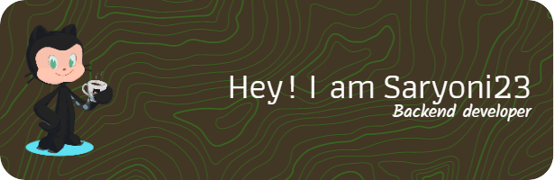

 

## 👋 About Me

Hey there

Hello Everyone... Introduce my name is Indra Saryoni Simanjuntak. I am a Backend Developer from Medan city. Currently, I am a full-stack Backend developer and focus on PHP, especially on the Codeigniter framework. Currently, I still like coding and consider coding part of my hobby. And on the sidelines of busy coding, I always learn about new things such as learning new frameworks or anything that will work later to develop the applications that I make, And this is a small part of me. If you are interested or want to ask about me then contact me via the form below

Want to know more about me? [Check out my portfolio.](https://saryoni23.github.io/)

## 📝 Latest Blog Posts

 

<!-- BLOG-POST-LIST:START -->
<!-- - [The Powerful CSS not Selector](https://braydoncoyer.dev/blog/the-powerful-css-not-selector) -->

<!-- - [How to Enable Preview Mode in Next.js for your CMS](https://braydoncoyer.dev/blog/how-to-enable-preview-mode-in-next.js-for-your-cms) -->
<!-- - [Tailwind Gradients - How to Make a Glowing Gradient Background](https://braydoncoyer.dev/blog/tailwind-gradients-how-to-make-a-glowing-gradient-background) -->
<!-- - [6 BEST Fonts for Programming in 2022](https://braydoncoyer.dev/blog/6-best-fonts-for-programming-in-2022) -->
<!-- - [A New Opportunity at LogicGate](https://braydoncoyer.dev/blog/a-new-opportunity-at-logicgate) -->
<!-- BLOG-POST-LIST:END -->

<!--   -->

## 📌 Pinned Repositories

 

 

## &#x1f4c8; GitHub Stats

 

 
 

## 💼 Skills

<!--   -->
<!--  -->
<!--  -->
<!--  -->
<!--  -->

More Skills

 

 

<!--  -->
<!--  -->
<!--  -->
<!--  -->
<!--  -->
<!--  -->
<!--  -->
<!--  -->
<!--  -->
<!--  -->
<!--  -->

 

 
<!-- 
## 📣 How about an Office quote before you go? -->

<!-- > It's performance review day, company-wide. Last year, my performance review started with Michael asking me what my hopes and dreams were, and it ended with him telling me he could bench-press 190 pounds. So, I don't really know what to expect.
> -->

<!-- > 
- Pam Beesly
 -->

<!--
_Quote requested from [The Office API](https://www.officeapi.dev/)_ -->

<!-- Check back at the top of the hour for a new quote!

 

> ### Want to know how I made this README?
>
> Check out my [tutorial](https://saryoni23.dev/blog/creating-a-killer-github-profile-readme-part-1/)! -->
